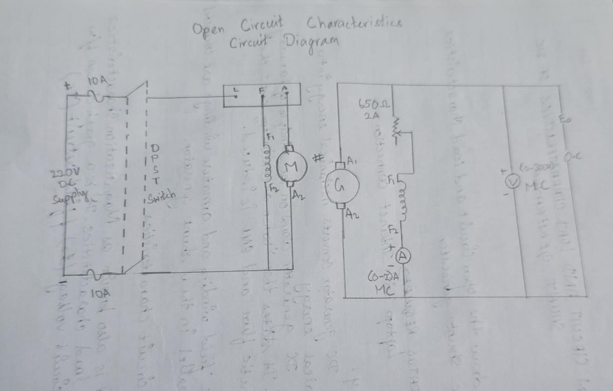
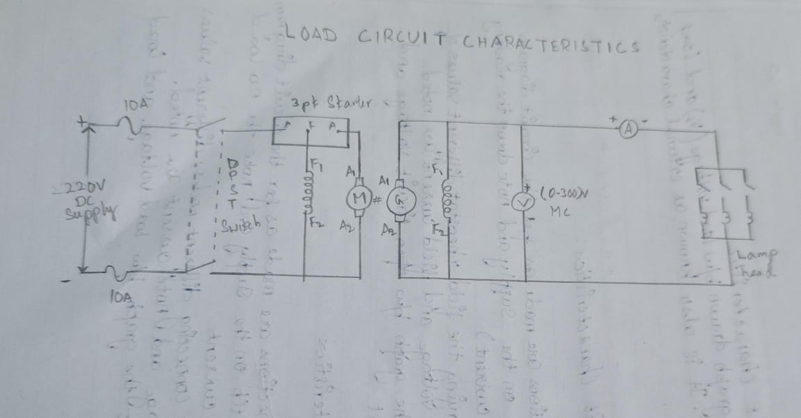

# EX2 : OCC AND LOAD CHARACTERISTICS OF D.C SHUNT GENERATOR

## AIM:
To conduct load test on separately excited generators and to obtain the characteristics

## APPARATUS REQUIRED:

### S.No	Apparatus	Range	Type	Quantity
1	Volt meter	(0-300)V	MC	1

2	Ammeter	(0-2.5)A	MC	1

3	Ammeter	(0-5)A	MC	1

4	Rheostat		Wire wouned	1

5	Rheostat		Wire wouned	1

6	Connecting wires	-	-	As required

## FUSE RATING CALCULATION FOR FIELD AND ARMATURE:

### NO LOAD TEST:

10 % of rated current (full load current)

### LOAD TEST:

125 % of rated current (full load current)

## PRECAUTIONS:

1.   Motor side field rheostat should be kept at minimum resistance position.
2.   Generator side field rheostat should be kept at maximum resistance position.
3.   Starter should be in off position before switching on the supply.
4.   The DPST switch must be kept open.Procedure for open circuit test
## PROCEDURE:
1.   Connections are given as per the circuit diagram.
2.   The motor is started with the help of THREE POINT starter.
3.   Adjust the motor speed to rated speed by adjusting motor field rheostat when the generator is disconnected from the load by DPST switch 2.
4.   By  varying  the  generator  field  rheostat  gradually,  the  open  circuit  voltage  [Eo]  and corresponding field current (If) are tabulated up to 125 % of rated voltage of generator.
5.   The motor is switched off by using DPST switch 1 after bringing all the rheostats to initial position.

### PROCEDURE FOR LOAD TEST:

1.   Connections are given as per the circuit diagram
2.   The prime mover is started with the help of three point starter and it is made to run at rated speed when the generator is disconnected from the load by DPST switch 2.
3.   By varying the generator field rheostat gradually, the rated voltage [Eg] is obtained.
4.   The ammeter and voltmeter readings are observed at no load condition.
5.   The ammeter and voltmeter readings are observed for different loads up to the rated current by closing the DPST switch 2.
6.   After tabulating all the readings the load is brought to its initial position.
7.   The motor is switched off by using DPST switch 1 after bringing all the rheostats to initial position.

## MODEL GRAPH:

## OPEN CIRCUIT CHARACTERISTICS:

## LOAD CHARACTERISTICS:

 
# RESULT:
The load test on separately excited generators and to obtain the characteristics was verified.
